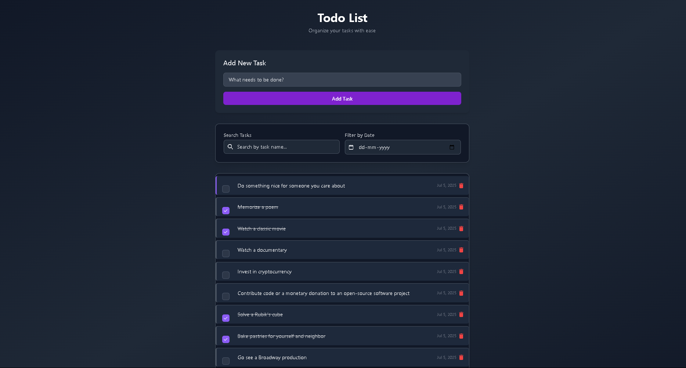

# Todo List Application

A modern, responsive Todo List web application built with vanilla JavaScript, HTML, and Tailwind CSS. This application allows users to manage their tasks with a clean and intuitive interface.



## Features

- 📝 Add new tasks with a simple form
- ✅ Mark tasks as complete/incomplete
- 🔍 Search tasks by name
- 📅 Filter tasks by date range
- 📱 Fully responsive design
- 🎨 Modern UI with smooth animations
- 📱 Works on all devices
- ⚡ Fast and lightweight

## Technologies Used

- **Frontend**: 
  - HTML5
  - CSS3 (with Tailwind CSS)
  - JavaScript (ES6+)
- **API**: [DummyJSON](https://dummyjson.com/)
- **Icons**: Font Awesome
- **Deployment**: Netlify (ready)

## Getting Started

### Prerequisites

- A modern web browser (Chrome, Firefox, Safari, Edge)
- No build tools or Node.js required

### Installation

1. Clone the repository:
   ```bash
   git clone https://github.com/yourusername/todo-list-app.git
   cd todo-list-app
   ```

2. Open `index.html` in your web browser.

### Usage

1. **Adding a Task**
   - Type your task in the input field
   - Press Enter or click the "Add Task" button

2. **Completing a Task**
   - Click the checkbox next to a task to mark it as complete
   - Click again to mark as incomplete

3. **Deleting a Task**
   - Click the trash can icon next to the task
   - Confirm the deletion in the popup

4. **Searching Tasks**
   - Type in the search box to filter tasks by name

5. **Filtering by Date**
   - Use the "From" and "To" date pickers to filter tasks by creation date

## Project Structure

```
todo-list-app/
├── index.html          # Main HTML file
├── styles.css          # Custom CSS styles
├── app.js              # Main JavaScript application logic
└── README.md           # This file
```

## Code Overview

### Key JavaScript Functions

- `init()`: Initializes the application
- `fetchTodos()`: Fetches todos from the API
- `handleAddTodo()`: Handles adding new todos
- `toggleTodoCompletion()`: Toggles todo completion status
- `deleteTodo()`: Deletes a todo
- `filterTodos()`: Filters todos based on search and date range
- `renderTodos()`: Renders todos to the DOM
- `updatePagination()`: Updates pagination controls
- `changePage()`: Handles pagination

### Styling

The application uses Tailwind CSS for styling with some custom CSS for animations and overrides. The design is fully responsive and works on all device sizes.

## API Integration

The application uses the DummyJSON API for todo operations:
- `GET /todos`: Fetch todos
- `POST /todos/add`: Add a new todo
- `PUT /todos/:id`: Update a todo
- `DELETE /todos/:id`: Delete a todo

## Deployment

This application is ready to be deployed on Netlify:

1. Push your code to a GitHub repository
2. Log in to [Netlify](https://www.netlify.com/)
3. Click "New site from Git"
4. Select your repository
5. Configure build settings (not required for this static site)
6. Click "Deploy site"

## Contributing

Contributions are welcome! Please feel free to submit a Pull Request.

## License

This project is open source and available under the [MIT License](LICENSE).

## Acknowledgements

- [DummyJSON](https://dummyjson.com/) for the free mock API
- [Tailwind CSS](https://tailwindcss.com/) for the utility-first CSS framework
- [Font Awesome](https://fontawesome.com/) for the icons

---

Made with ❤️ by Aditya Bora
